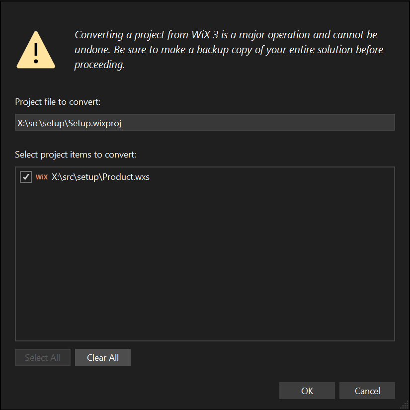

## What's new in WiX v6

WiX v6 continues to be highly compatible in its language syntax with WiX v5 and even v4. We're liking how easy it is to pick up new versions of WiX without worrying about code conversion.

WiX v6 contains a number of bug fixes and new features, and introduces an Open Source Maintenance Fee:


### Open Source Maintenance Fee

<a href="https://opensourcemaintenancefee.org/"></a>

To ensure the long-term sustainability of the WiX Toolset, starting in WiX v6, use of the project requires an [Open Source Maintenance Fee](https://opensourcemaintenancefee.org). While the source code is freely available under the terms of the [LICENSE](https://github.com/wixtoolset/wix/blob/main/LICENSE.TXT), other aspects of the project--including opening issues and downloading releases--require adherence to the Maintenance Fee.

In short, if you use this project to generate revenue, the [Open Source Maintenance Fee is required](https://opensourcemaintenancefee.org).

To pay the Maintenance Fee, [become a Sponsor](https://github.com/sponsors/wixtoolset).


### GUIDs are now optional for upgrade codes

Windows Installer uses GUIDs at the drop of a hat...any hat. It's hard to complain because GUIDs are perfect as unique identifiers (it's right in the name). But they're definitely awkward and WiX has been on a 20+-year-fight to get rid of them where feasible. This year, we got rid of the last "mandatory" GUID: The upgrade code.

:::note[Well, actually...]
Upgrade codes in MSI packages aren't _technically_ mandatory, but omitting them is a bad idea. So bad, in fact, that they _are_ mandatory for bundles.
:::

The _concept_ of an upgrade code is still needed: MSI and Burn need a way to identify a "family" of product versions that can upgrade each other. But now you can use a human-readable string in its `Id` attribute rather than a GUID in an `UpgradeCode` attribute:

```xml
<Package 
  Id="Acme.HelloWorld" 
  Name="HelloWorld" 
  Version="6.0.0" 
  Manufacturer="Acme"> 
...
```

The `Bundle` element follows the same change:

```xml
<Bundle 
  Id="Acme.HelloWorld.Bundle" ...
...
```

Choose your human-readable string carefully. Change it only when you'd change the upgrade code GUID, which is when you want packages and bundles to stop upgrading each other. Typically that's when you want product versions to live side-by-side. For example, if you wanted a product that would only upgrade other v6.x.x versions, you could use that version in the `Id`:

```xml
<Package 
  Id="Acme.HelloWorld.V6" 
  Name="HelloWorld" 
  Version="6.0.0" 
  Manufacturer="Acme">
...
```

Change it to `Id="Acme.HelloWorld.V7"` when that time comes and the package will no longer upgrade any v6.x.x version.

:::note
You can still specify upgrade code GUIDs in the `UpgradeCode` attribute. Human-readable `Id`s are an optional replacement. You can't use both `UpgradeCode` and `Id`.

Behind the scenes, WiX turns the human-readable string into a GUID.
:::


### WixUI is now custom-action-free (by default)

The WixUI dialog library used to have two custom actions that were unconditionally included into MSI packages that used any WixUI dialog. That was suboptimal for two reasons:

1. Every MSI package was (slightly) bloated by the size of the custom action DLL.
2. Customizing WixUI dialog sets got more complicated because all WiX custom actions come in architecture-specific flavors.

WiX v5 addressed one of the custom actions and WiX v6 addresses the other, so now no custom actions are used unless you ask for the path validation custom action. You do that by specifying `ExtendedPathValidation="yes"` on the `WixUI` element, like so:

```xml
<ui:WixUI 
  Id="WixUI_InstallDir" 
  InstallDirectory="INSTALLFOLDER" 
  ExtendedPathValidation="yes" />
```


### Burn locks extracted payloads

:::caution[Breaking change]
Burn now locks payloads for read-only access as they're extracted from the bundle. This is an additional layer of Burn's defense in depth against malware attacks. In previous versions of WiX, a bootstrapper application could modify its payloads. Because payloads are now locked for read-only access, attempts to modify a BA's payloads now fail. If you need to modify a file, you need to copy it to a different directory before trying to write to it.
:::


### Managed bootstrapper application API changes

:::caution[Breaking change]
Due to bugs in WiX v5 fixed in WiX v6, the `IEngine.SetUpdateSource` and `IEngine.SetDownloadSource` have breaking API changes. A string parameter was added and needs to be added to your managed bootstrapper application:

```xml
void SetUpdateSource(
  string url, 
  string authorizationHeader);

void SetDownloadSource(
  string packageOrContainerId, 
  string payloadId,
  string url, 
  string user, 
  string password, 
  string authorizationHeader);
```
:::


## What's new in WiX v5

WiX v5 is **highly** compatible with WiX v4. WiX v5 continues in the traditions of WiX v4 and is available as both a .NET tool and an MSBuild SDK. The WiX v5 language uses the same XML namespace as WiX v4 and -- with a couple of exceptions -- is backward compatible with the WiX v4 language. That means that you don't need to translate your WiX v4 projects to use WiX v5.


### File harvesting

An all-too-common question on [GitHub discussions](https://github.com/wixtoolset/issues/discussions) and [Stack Overflow](https://stackoverflow.com/questions/tagged/wix?sort=newest) is of the form "how do I install all the files in a directory?" In WiX v4 and prior, the answer was typically "use Heat and some arcane XSLT." In WiX v5, use `Files`.

`Files` takes wildcarded paths to include _and exclude_ files, traverses the specified directories, and generates components and files for each file.

Combined with other features in this list, you can now build a package with potentially thousands of files with some impressively compact WiX authoring:

```xml
<Wix xmlns="http://wixtoolset.org/schemas/v4/wxs">
    <Package Name="MyProduct" Version="1.0.0.0" Manufacturer="Example Corporation" UpgradeCode="B0B15C00-1DC4-0374-A1D1-E902240936D5">
        <Files Include="path\to\files\**" />
    </Package>
</Wix>
```

With exclusions, you can exclude files that require special handling, like services:

```xml
<Wix xmlns="http://wixtoolset.org/schemas/v4/wxs">
    <Package Name="MyService" ...>
        <Files Include="!(bindpath.bin)**">
            <!--
            Don't harvest the service because it needs manual authoring (below).
            -->
            <Exclude Files="!(bindpath.bin)foo.exe" />
        </Files>

        <!--
        This file is a service and therefore needs lovingly hand-crafted authoring.
        -->
        <Component>
            <File Source="!(bindpath.bin)foo.exe" />
            <ServiceInstall ... />
            <ServiceControl ... />
        <Component>
    </Package>
</Wix>
```

For more information, see the [`Files` WIP](https://github.com/wixtoolset/issues/issues/7857), the associated [pull request](https://github.com/wixtoolset/wix/pull/489), and the [`Files` element schema documentation](../schema/wxs/files/).


### Naked files

[For a little while now](https://joyofsetup.com/2009/12/31/simplifying-wix-component-authoring/), WiX has supported simplified authoring for the simple scenario of one file in a component:

```xml
<Component>
    <File Source="foo.exe" />
</Component>
```

But add a few dozen of them and you start to wonder about the need for the mostly-empty `Component` elements. Wonder no longer. WiX v5 adds support for so-called "naked" files, which are files without the XML overhead of enclosing `Component` elements. Wherever `Component` elements can appear, so can `File` elements. In the compiler, WiX conjures appropriate components for each file. Simple authoring is now simpler.

```xml
<ComponentGroup Id="Files" Directory="MyFolder" Subdirectory="bin">
  <File Source="foo.exe" />
  <File Source="bar.dll" />
  <File Source="baz.db" />
</ComponentGroup>
```

For more information, see the [_Naked File_ WIP](https://github.com/wixtoolset/issues/issues/7696) and the associated [pull request](https://github.com/wixtoolset/wix/pull/479).


### Default major upgrades

Welcome to the first of three "provide reasonable defaults so setup developers don't need to specify boring stuff over and over" features.

Authoring major upgrades has been straightforward since 2010 but, like with naked files, it sometimes feels silly to have to author unchanging content. But as I said [back then](https://joyofsetup.com/2010/01/16/major-upgrades-now-easier-than-ever/):

> Downgrades are blocked by default, which requires you to specify a message for the launch condition message.

However, part of the impetus behind `virtual` and `override` access modifiers was the idea that WiX could now include a [_WiX Standard Library_](https://github.com/wixtoolset/issues/issues/7914), which coincidentally could include a set of default localization strings. That lets us address the need for the "downgrade blocked" message -- well, at least for speakers of US English.

So now in WiX v5, if your package doesn't have a major upgrade (via `MajorUpgrade` or old-school `Upgrade` elements), WiX will give you one for free. It uses a US English string, so if you need another language, override the localization string with a localization file:

```xml
<?xml version="1.0" encoding="utf-8"?>
<WixLocalization xmlns="http://wixtoolset.org/schemas/v4/wxl" Culture="en-US">
    <String Id="WixDowngradePreventedMessage" Value="[ProductName] does not support downgrading." />
</WixLocalization>
```

For more information, see the [_Default major upgrade behavior and localized error message_ WIP](https://github.com/wixtoolset/issues/issues/7605) and the associated [pull request](https://github.com/wixtoolset/wix/pull/478).


### Default installation folder

Welcome to the second "provide reasonable defaults so setup developers don't need to specify boring stuff over and over" feature.

WiX v4 eliminated a lot of the verbosity required to author directories in a WiX project -- eliminating `TARGETDIR`, adding `StandardDirectory` elements and the awesome `Subdirectory` attribute. WiX v5 takes advantage of that and adds one more: If you reference a directory with an id of `INSTALLFOLDER` but don't define one, WiX gives you one. That default `INSTALLFOLDER` is the equivalent of the following WiX authoring:

```xml
<StandardDirectory Id="ProgramFiles6432Folder">
    <Directory
        Id="INSTALLFOLDER"
        Name="!(bind.Property.Manufacturer) !(bind.Property.ProductName)"
    />
</StandardDirectory>
```

The directory gets its name from the `Package/@Manufacturer` and `Package/@Name` attribute values.

And don't worry -- if you already have such an `INSTALLFOLDER` or never reference a directory with that id, WiX respects your beliefs and won't try to force its own `INSTALLFOLDER` on you or your package.

For more information, see the [_Default root directory_ WIP](https://github.com/wixtoolset/issues/issues/7588) and the associated [pull request](https://github.com/wixtoolset/wix/pull/435).


### Default feature

Welcome to the final "provide reasonable defaults so setup developers don't need to specify boring stuff over and over" feature.

Fancy, complicated feature trees are passé but MSI requires at least one feature. So if you don't need multiple features, let's let WiX create one for you and automatically assign components to it.

Meet the default feature feature.

Again, if you have a set of `Feature` elements, WiX lets them be. This feature kicks in _only_ if you haven't authored any features in your package.

For more information, see the [_Default feature_ WIP](https://github.com/wixtoolset/issues/issues/7581) and the associated [pull request](https://github.com/wixtoolset/wix/pull/424).


### Virtual and overridable symbols

WiX has supported letting setup developers override the defaults provided by WiX or its extensions for things like when custom actions are scheduled. (Technically, overridability was available for everyone everywhere but the canonical example is overriding scheduling for custom actions in WiX extensions, so let's go with that.) It worked by letting you specify that something was `Overridable="yes"` so that _your_ version took precedence over the overridable one. For example, here's how the `CloseApplications` custom action is defined in `WixToolset.Util.wixext` in WiX v4:

```xml
<InstallExecuteSequence>
    <Custom
        Action="$(var.Prefix)CloseApplications$(var.Suffix)"
        Before="InstallFiles"
        Overridable="yes"
        Condition="VersionNT &gt; 400" />
</InstallExecuteSequence>
```

To reschedule the custom action, you'd use the following:

```xml
<InstallExecuteSequence>
    <Custom
        Action="Wix4CloseApplications_$(sys.BUILDARCHSHORT)"
        After="InstallInitialize" />
</InstallExecuteSequence>
```

WiX v5 introduces the concept of `virtual` and `override` access modifiers for symbol identifiers, which are very similar to the same keywords you find in languages like C# and C++:

- `virtual` declares that the identifier can be overridden.
- `override` declares that the identifier overrides the corresponding `virtual` identifier.

So now, WiX extensions define custom action scheduling with the `virtual` access modifier:

```xml
<InstallExecuteSequence>
    <Custom
        Action="virtual $(var.Prefix)CloseApplications$(var.Suffix)"
        Before="InstallFiles"
        Condition="VersionNT &gt; 400" />
</InstallExecuteSequence>
```

And to reschedule it, use the `override` access modifier to override the scheduling provided by the `virtual` symbol:

```xml
<InstallExecuteSequence>
    <Custom
        Action="override Wix4CloseApplications_$(sys.BUILDARCHSHORT)"
        After="InstallInitialize" />
</InstallExecuteSequence>
```

For more information, see the [_Virtual Symbols_ WIP](https://github.com/wixtoolset/issues/issues/7913) and the associated [pull request](https://github.com/wixtoolset/wix/pull/475).


### Burn

- [`ArpEntry`](../schema/wxs/arpentry/) supports the `AdditionalUninstallArguments` attribute to add arguments to the uninstall command line and `UseUninstallString` to tell Burn to use the `UninstallString` value instead of the default `QuietUninstallString`. Thanks to [@nirbar](https://github.com/nirbar) for the [pull request](https://github.com/wixtoolset/wix/pull/471).
- Bootstrapper applications are now separate processes rather than hosted by the Burn engine, to increase reliability and security. Being out-of-process also increases compatibility, as Burn no longer needs special support to host .NET or any other language/runtime, for that matter. Want to write a BA in COBOL? You do you. [See more information about out-of-proc BAs.](oopbas/)


### Extension changes

- WixToolset.DifxApp.wixext was deprecated in WiX v4 and was removed in WiX v5. (Microsoft deprecated the underlying DifxApp several years ago.)
- WixToolset.Firewall.wixext now supports the capabilities of the modern Windows Firewall. See [the documentation](../schema/firewall/firewallexception/) for all the new goodness. Thanks to [@chrisbednarski](https://github.com/chrisbednarski) for all [the work](https://github.com/wixtoolset/wix/pulls?q=is%3Apr+author%3Achrisbednarski).
- WixToolset.Netfx.wixext's [DotNetCompatibilityCheck](../schema/netfx/dotnetcompatibilitycheck/) now sets the specified property to 13 when the requested platform is not compatible with the platform the installer is running on. Thanks to [@apacker1](https://github.com/apacker1) for the [pull request](https://github.com/wixtoolset/wix/pull/459).
- WixToolset.Util.wixext now has the following `_NODOMAIN` properties from [WixQueryOsWellKnownSID](../tools/wixext/wininfo/#querywindowswellknownsids-properties): `WIX_ACCOUNT_ADMINISTRATORS_NODOMAIN`, `WIX_ACCOUNT_GUESTS_NODOMAIN`, `WIX_ACCOUNT_LOCALSERVICE_NODOMAIN`, `WIX_ACCOUNT_LOCALSYSTEM_NODOMAIN`, `WIX_ACCOUNT_NETWORKSERVICE_NODOMAIN`, and `WIX_ACCOUNT_USERS_NODOMAIN`. Thanks to [@mistoll](https://github.com/mistoll) for the [pull request](https://github.com/wixtoolset/wix/pull/407).

See [Out-of-process bootstrapper applications](oopbas/) for additional extension changes related to building bundles.


## What's new in WiX v4

A lot about WiX has changed between v3 and v4 but the nuts and bolts of authoring .wxs files will appear very similar. Here's a [FAQ discussing changes to packages and bundle](./faqs/). Here are some higher-level things that have changed:

- WiX v4 doesn't have to be installed on every dev machine and build image like WiX v3. Instead, WiX v4 follows the modern .NET model of using NuGet to deliver tools.
  - WiX v4 MSBuild projects are SDK-style projects; MSBuild and NuGet work together to bring down the WiX v4 MSBuild SDK NuGet package.
  - Both .NET Framework MSBuild and `dotnet build` are supported.
  - To build packages from the command line, WiX v4 is available as a .NET tool, which is also a NuGet package.
  - WiX extensions are delivered as NuGet packages, which are usable from both MSBuild projects via `PackageReference` and the WiX .NET tool.
- For command-line afficionados, most executables have been merged into a single `wix.exe` tool with commands. For example, in WiX v3, you might build by calling Candle.exe one or more times to compile your authoring and then calling Light.exe to link and bind the compiled authoring into an .msi package. In WiX v4 using `wix.exe`, that's one command: `wix build -o product.msi product.wxs`.

The WiX v4 language has some simplifications and uses a new namespace, so WiX v3 authoring needs to be converted. Luckily, there's an app for that.


### Convert WiX authoring from the command line

To convert WiX v3 authoring to WiX v4 from the command line, first install the [WiX .NET tool](/wix/using-wix/#command-line-net-tool). Then you can run `wix convert`:

:::tip
By default, `wix convert` converts the files in place, overwriting the original files. You can add the `--dry-run` switch to have `wix convert` report on what changes it would make without actually making them. Of course, your setup source code is in version control, so you can always easily revert the changes `wix convert` makes. I mean, it is in version control, right?!
:::

- To convert an individual WiX source file: `wix convert path\to\file.wxs`.
- To convert all WiX source files in a specified directory: `wix convert path\to\*.wxs`.
- To convert all WiX source, include, and localization files in a specified directory: `wix convert path\to\*.wx?`.
- To convert all WiX source, include, and localization files in a specified directory tree: `wix convert --recurse path\to\*.wx?`.


### Convert WiX projects and authoring from Visual Studio

[FireGiant](https://www.firegiant.com/)'s [HeatWave Community Edition][heatwave] includes support for converting WiX v3 authoring (like using `wix convert`) and converting WiX v3 .wixproj MSBuild projects to SDK-style WiX v4 projects.



[HeatWave Community Edition is available free of charge.][heatwave]

[heatwave]: https://www.firegiant.com/wix/heatwave/
