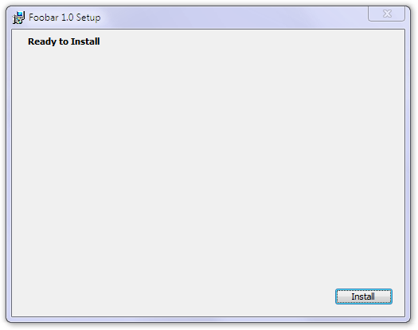

We start with a single, simple interface---nothing but a title and a single button to start the installation with.

Dialogs must always have a unique identifier. The dialog size is standard because the wizard we use has a standard size. The `Title` is straightforward but note that here too, you can reference properties using the square bracket notation. Quite handy as you don't have to re-edit the whole UI part when you create an installer package for a new product. `ProductName` is automatically defined to denote the product name you have defined in the `Product` tag at the very beginning of the source file.

    <Dialog Id="InstallDlg" Width="370" Height="270" Title="[ProductName] Setup" NoMinimize="yes">

Everything we add to the dialog will be a control. A `Type` attribute describes the kind of control (`Billboard`, `Bitmap`, `CheckBox`, `ComboBox`, `DirectoryCombo`, `DirectoryList`, `Edit`, `GroupBox`, `Icon`, `Line`, `ListBox`, `ListView`, `MaskedEdit`, `PathEdit`, `ProgressBar`, `PushButton`, `RadioButtonGroup`, `ScrollableText`, `SelectionTree`, `Text`, `VolumeCostList` or `VolumeSelectCombo`). For simple text (called static text in usual Windows parlance because it doesn't do anything, you can't click on it, it is just there), we use the type `Text`. We specify position and dimensions.

Title text elements are marked `Transparent`, for the benefit of the general case. These texts overlay the banner bitmap at the top. As they are written in black over a white background now, transparency doesn't do any difference but if you would provide a full banner picture extending below the title text and colored text, it would make for nice visual effects. `NoPrefix` only controls whether ampersand characters are displayed verbatim or used as shortcut specifiers, as usual in the Windows GUI.

    <Control Id="Title" Type="Text" X="15" Y="6" Width="200" Height="15" Transparent="yes" NoPrefix="yes">
        <Text>{\DlgTitleFont}Ready to Install</Text>
    </Control>

You have two ways of specifying the text of the control: either the `Text` child tag inside the control or the `Text` attribute:

    <Control Id="Title" Type="Text" X="15" Y="6" Width="200" Height="15" Transparent="yes" NoPrefix="yes" 
        Text="{\DlgTitleFont}Ready to Install"/>

We can refer to font styles using `TextStyle` tags. We also need to include a standard property, `DefaultUIFont` and associate a font with it because the installer needs it to determine the default font.

    <Property Id="DefaultUIFont">DlgFont8</Property>
    <TextStyle Id="DlgFont8" FaceName="Tahoma" Size="8" />
    <TextStyle Id="DlgTitleFont" FaceName="Tahoma" Size="8" Bold="yes" />

Our only active control will be a push button (of type `PushButton`). Again, we specify position and dimensions. As the only one, it will be our default button too (sensitive to pressing the Enter key). Active user interface elements that do something when the user activates them will also have a `Publish` tag nested inside to define what to do when the activation happens. There is a long list of possible standard events to select from, `EndDialog` is one of them). So, the action will now be `EndDialog` with a value of `Return`, meaning to dismiss the dialog the normal way, without any error to be signaled:

    <Control Id="Install" Type="PushButton" X="304" Y="243" Width="56" Height="17" Default="yes" Text="Install">
        <Publish Event="EndDialog" Value="Return" />
    </Control>

So, we already have our dialog but we have to schedule it into the normal course of events. Go to the part just before the closing `UI` tag and make the following changes: clear `AdminUISequence` as we are not worrying about administrative install now.

`InstallUISequence` has already been mentioned but now it's time to discuss its interaction with `InstallExecuteSequence.`

The course of standard actions is broken into two at the middle, the `InstallValidate` action, which is responsible for the verification of available disk space and also for notifying the user if one or more files to be overwritten by the installation are currently in use. Actions up to `InstallValidate` (including various dialog boxes) are listed in `InstallUISequence` while those following this action can be found in `InstallExecuteSequence`. There are exceptions, though, to this rule. `InstallUISequence` is not consulted during an installation with basic UI or no UI at all, so `InstallExecuteSequence` has to be standalone even in this case. To this end, it duplicates some actions from the other table as well. If we check out our current sample with Orca, `InstallUISequence` will contain:

* ValidateProductID
* CostInitialize
* FileCost
* CostFinalize
* ExecuteAction

These are actions we already know, except for the last one. During installation, both tables will be consulted initially and the actions executed in order of their sequence number (as the duplicated actions have the same number in both tables, this won't create any ambiguity). `ExecuteAction` is scheduled to the point where all information collection necessary to begin the actual installation has already been completed. Execution then passes to `InstallExecuteSequence` to perform the actions responsible for the actual process of installation.

Consequently, we have to schedule our single dialog box after the last action in the preparation process, `CostFinalize` but still before ExecuteAction`:

    <InstallUISequence>
      <Show Dialog="InstallDlg" After="CostFinalize" />
    </InstallUISequence>

Build this sample ([SampleCustomUI](/system/files/samples/SampleCustomUI.zip)) and run it. You will be presented a dialog and when you press the Install button, our usual three files will be installed. Note that there will be no progress dialog, just a silent install. Also, you can't cancel the installation, if you start it, you have to finish it.

Note that the built-in validator of WiX will emit ICE 20 warnings about some missing features of the standard user interface. Because the starting versions of our custom UI lesson are far from being a full standard interface, these warnings can be suppressed using a command line switch:

    candle.exe SampleCustomUI1.wxs
    light.exe -sice:ICE20 SampleCustomUI1.wixobj
