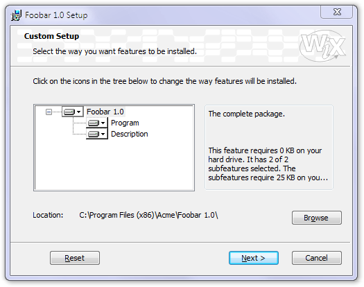

Now we'll do something much more ambitious. We will allow the user to customize the setup, to decide which features to install and to tell the installer where to install the files to.

First of all, to reduce the complexity of our samples, we send all textual items into a separate fragment file UI_Texts.wxs. The actual texts come from the WiX source and list all possible entries eventually needed by our UI experiments. We will simply call it with a reference and use the following build process:

    candle.exe SampleCustomUI4.wxs UI_Texts.wxs
    light.exe -out SampleCustomUI4.msi SampleCustomUI4.wixobj UI_Texts.wixobj

We start a new dialog that will offer the necessary controls---first of all, a tree view of the features. It will be quite simple because the controls of the `SelectionTree` type are not simple treeview controls but they are linked by the installer to the available features and their selection status:

    <Dialog Id="CustomizeDlg" Width="370" Height="270" Title="[ProductName] Setup"
      NoMinimize="yes" TrackDiskSpace="yes">
      <Control Id="Tree" Type="SelectionTree" X="25" Y="85" Width="175" Height="95"
        Property="_BrowseProperty" Sunken="yes" TabSkip="no" Text="Tree of selections" />

The dialog will have several push buttons. `Browse` will be enabled by the installer automatically if we used the `ConfigurableDirectory` attribute in the `Feature` tag. There are several control events to be used in relation to selection trees, `SelectionBrowse` will launch the specified browse dialog so that the user can modify the path to install to. We'll return to this browse dialog in a short while:

    <Control Id="Browse" Type="PushButton" X="304" Y="200" Width="56" Height="17"
        Text="[ButtonText_Browse]">
        <Publish Event="SelectionBrowse" Value="BrowseDlg">1</Publish>
    </Control>

The `Reset` button uses a prefabricated event, called `Reset` to return all controls in the dialog to the status they were in when the dialog was created. This undoes all feature customizations made by the user.

This button not only sends event messages but makes itself a recipient for similar messages by _subscribing_ to an event. `SelectionNoItems` will disable buttons that subscribe to it if the selection tree has no nodes:

    <Control Id="Reset" Type="PushButton" X="42" Y="243" Width="56" Height="17"
        Text="[ButtonText_Reset]">
        <Publish Event="Reset" Value="0">1</Publish>
        <Subscribe Event="SelectionNoItems" Attribute="Enabled" />
    </Control>

There will be other buttons and simple controls in the dialog that are already familiar to us. We don't detail them any more here, check out the source file for reference. What we check in detail is the box at the right of the dialog. A `Text` control will be used to display information about the item the user has currently selected in the selection tree. Although the control has an initial text (`Multiline description of the currently selected item`), this will not appear but will be replaced by the actual selection information. This happens because the control subscribes to the `SelectionDescription` event. As soon as there is a change in the selection, the installer will report the new description to any control subscribing to this event:

    <Control Id="Box" Type="GroupBox" X="210" Y="81" Width="140" Height="98" />

    <Control Id="ItemDescription" Type="Text" X="215" Y="90" Width="131" Height="30">
        <Text>Multiline description of the currently selected item.</Text>
        <Subscribe Event="SelectionDescription" Attribute="Text" />
    </Control>

The same happens to the other controls. `ItemSize` subscribes to receive the size of the current selection, `Location` to learn the path selected by the user. The last two also check whether there is a path to be set. If there is none, both the label and the path display will be suppressed. This is what makes the path selection disappear when you travel the selection tree and go to the subnodes instead of the main one:

    <Control Id="ItemSize" Type="Text" X="215" Y="130" Width="131" Height="45">
        <Text>The size of the currently selected item.</Text>
        <Subscribe Event="SelectionSize" Attribute="Text" />
    </Control>

    <Control Id="Location" Type="Text" X="75" Y="200" Width="215" Height="20">
        <Text><The selections path></Text>
        <Subscribe Event="SelectionPath" Attribute="Text" />
        <Subscribe Event="SelectionPathOn" Attribute="Visible" />
    </Control>

    <Control Id="LocationLabel" Type="Text" X="25" Y="200" Width="50" Height="10" Text="Location:">
        <Subscribe Event="SelectionPathOn" Attribute="Visible" />
    </Control>

We told the installer to call our `BrowseDlg` dialog when the user clicks on the `Browse` button, so we have to provide this dialog as well:

If you go back and check out the previous `Dialog` tag, you'll see a `Property` reference. We specify it here, in our path edit control again---this is what creates the link between the dialog asking for the path and this one providing it. Setting `Indirect` tells the installer to modify not the property directly mentioned (`_BrowseProperty`) but the property that this property holds the name of.

    <Dialog Id="BrowseDlg" Width="370" Height="270" Title="[ProductName] Setup" NoMinimize="yes">
      <Control Id="PathEdit" Type="PathEdit" X="84" Y="202" Width="261" Height="18"
        Property="_BrowseProperty" Indirect="yes" />

When the user is satisfied with the newly selected path and hits OK, the property value will be set by the `SetTargetPath` event. The installer also checks whether the selected path is valid. If the user decides not to set the path after all, we use the `Reset` event to return everything to the initial settings and will the dialog without actually setting the path:

    <Control Id="OK" Type="PushButton" X="304" Y="243" Width="56" Height="17"
        Default="yes" Text="[ButtonText_OK]">
        <Publish Event="SetTargetPath" Value="[_BrowseProperty]">1</Publish>
        <Publish Event="EndDialog" Value="Return">1</Publish>
    </Control>

    <Control Id="Cancel" Type="PushButton" X="240" Y="243" Width="56" Height="17"
        Cancel="yes" Text="[ButtonText_Cancel]">
        <Publish Event="Reset" Value="0">1</Publish>
        <Publish Event="EndDialog" Value="Return">1</Publish>
    </Control>

A `DirectoryCombo` control displays the path stored in the referenced property in a hierarchical, tree-like view.

    <Control Id="ComboLabel" Type="Text" X="25" Y="58" Width="44" Height="10"
        TabSkip="no" Text="&Look in:" />

    <Control Id="DirectoryCombo" Type="DirectoryCombo" X="70" Y="55" Width="220" Height="80"
        Property="_BrowseProperty" Indirect="yes" Fixed="yes" Remote="yes">
        <Subscribe Event="IgnoreChange" Attribute="IgnoreChange" />
    </Control>

Two buttons with icons will be associated with the directory selection controls and will send the appropriate events when pressed:

    <Control Id="Up" Type="PushButton" X="298" Y="55" Width="19" Height="19"
        ToolTip="Up One Level" Icon="yes" FixedSize="yes" IconSize="16" Text="Up">
        <Publish Event="DirectoryListUp" Value="0">1</Publish>
    </Control>

    <Control Id="NewFolder" Type="PushButton" X="325" Y="55" Width="19" Height="19"
        ToolTip="Create A New Folder" Icon="yes" FixedSize="yes" IconSize="16" Text="New">
        <Publish Event="DirectoryListNew" Value="0">1</Publish>
    </Control>

And finally, a large `DirectoryList` in the middle, linked to the other directory control elements by the fact that it references the same property. All these controls will interact automatically as expected:

    <Control Id="DirectoryList" Type="DirectoryList" X="25" Y="83" Width="320" Height="110"
        Property="_BrowseProperty" Sunken="yes" Indirect="yes" TabSkip="no" />

The rest of the dialog is of no particular interest any more, check out the source if you feel the need.

There are only a couple of minor things left to do before we can build our SampleCustomUI4. We modify our `InstallDlg` dialog by adding a `Back` button so that the user can go back to the customization dialog:

    <Control Id="Back" Type="PushButton" X="180" Y="243" Width="56" Height="17"
      Text="[ButtonText_Back]">
      <Publish Event="NewDialog" Value="CustomizeDlg">1</Publish>
    </Control>

We have to modify the scheduling of our first dialog to make it appear in a phase where the customization should take place. Although there are alternatives to do that, we now schedule to the `MigrateFeatureStates` event. This event only happens during upgrading and installation, not during product removal or maintenance, right when it reads the feature selection of the previously installed product (if such a product exists). So, it will be the perfect place to show our customization dialog with the appropriate feature selection even in installation packages much more complicated than our current sample:

    <InstallUISequence>
      <Show Dialog="CustomizeDlg" After="MigrateFeatureStates">NOT Installed</Show>
    </InstallUISequence>

And finally, we don't forget to include the two new icons we needed in the browse dialog:

    <Binary Id="Up" SourceFile="Binary\Up.ico" />
    <Binary Id="New" SourceFile="Binary\New.ico" />

## Customizing Customizations

If we need to select the features to be installed automatically or based on other conditions, or maybe we want to create a completely new interface for the user to select them (for instance, checkboxes instead of `SelectionTree`), we can link the following events to the appropriate control (the `Next` button, for instance) to enable or disable the installation of a given feature:

    <Publish Event="AddLocal" Value="FeatureId">...condition...</Publish>
    <Publish Event="Remove" Value="FeatureId">...condition...</Publish>
