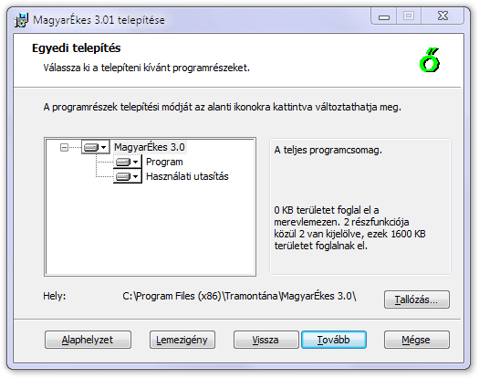

Installation packages have a large amount of text visible to the user: dialog text, informative or error messages. We moved them out into a separate fragment. To localize the installer, we could simply create parallel copies of this file translated to other languages. However, WiX offers an even better approach to localization that allows the systematic collection of all localizable strings and their replacement as late as during the linking phase. For each textual data in your source (including filenames), you can use preprocessor style references:

    <?xml version='1.0' encoding='windows-1252'?>
    <Wix xmlns='http://schemas.microsoft.com/wix/2006/wi'>

      <Product Name='Foobar 1.0' Id='YOURGUID-86C7-4D14-AEC0-86416A69ABDE'
        Language='!(loc.LANG)' Codepage='1252' Version='1.0.0' Manufacturer='Acme Ltd.'>

        <Package Id='*' Keywords='!(loc.Keywords)'
          Description='!(loc.Description)' Comments='!(loc.Comments)'
          InstallerVersion='100' Languages='1033' Compressed='yes' SummaryCodepage='1252' />

The actual meaning of all these variables will be listed in a localization file with an extension of .wxl:

    <?xml version="1.0" encoding="utf-8"?>
    <WixLocalization Culture="en-us" xmlns="http://schemas.microsoft.com/wix/2006/localization">
      <String Id="LANG" Overridable="yes">1033</String>
      <String Id="Keywords" Overridable="yes">Installer</String>
      <String Id="Description" Overridable="yes">Acme's Foobar 1.0 Installer</String>
      <String Id="Comments" Overridable="yes">Foobar is a registered trademark of Acme Ltd.</String>
    </WixLocalization>

To compile the package with a specific language file, you simply pass its name to the WiX linker:

    candle.exe Sample.wxs
    light.exe Sample.wixobj -loc Language.wxl

This concludes our user interface tour. We examined most of the controls provided by the installer. For additional details and possible attributes of the controls, consult the WiX and MSDN documentations. Armed with this knowledge, you can analyze the full interface library of the toolset (remember, it is open source). Although it has quite a few additional pages, their structure and interaction is just the same.
