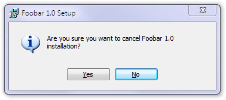

Building dialogs is rather simple (although there are many more control types we can stuff our pages with), it's making them interact that's really interesting. In SampleCustomUI3, we add a second dialog, allowing the user to cancel the installation process:

To achieve this, we need the dialog itself. It will have two push buttons but note the difference in terminology. A message box like this can have two outcomes, _cancelling_ it and _okaying_ it: going on with what it says. The question will be worded differently here: when we cancel the cancellation dialog, we vote for going on with the installation. Hence, we call our first, default button, with the text `No` our cancel button:

    <Dialog Id="CancelDlg" Width="260" Height="85" Title="[ProductName] Setup" NoMinimize="yes">
      <Control Id="No" Type="PushButton" X="132" Y="57" Width="56" Height="17"
        Default="yes" Cancel="yes" Text="[ButtonText_No]">
        <Publish Event="EndDialog" Value="Return">1</Publish>
      </Control>

If the user clicks on this button, we signal the `EndDialog` event with a value of `Return`. As its name implies, this simply dismisses the dialog and resumes the original operation. The `Publish` tag has a condition, the number 1 that always evaluates to true (a zero would evaluate to false), thus, the event will be signaled unconditionally.

Our second button, with the text `Yes` will trigger the same `EndDialog` event but with a different value: `Exit`. This is used to abort the whole installation process:

    <Control Id="Yes" Type="PushButton" X="72" Y="57" Width="56" Height="17" Text="[ButtonText_Yes]">
        <Publish Event="EndDialog" Value="Exit">1</Publish>
    </Control>

The rest is now simple, text and icon. Don't forget to add the `Binary` tag to include the icon in the package:

      <Control Id="Text" Type="Text" X="48" Y="15" Width="194" Height="30">
        <Text>Are you sure you want to cancel [ProductName] installation?</Text>
      </Control>

      <Control Id="Icon" Type="Icon" X="15" Y="15" Width="24" Height="24"
        ToolTip="Information icon" FixedSize="yes" IconSize="32" Text="[InfoIcon]" />
    </Dialog>

    <Binary Id="info" SourceFile="Binary\Info.ico" />

We also need some modification in our `InstallDlg` dialog. We moved our `Install` button to the left to make room for the `Cancel` button. This one will fire a `SpawnDialog` event, specifying the name of the dialog to be launched. As already mentioned in the previous lesson, `SpawnDialog` starts a new child dialog without removing the current one and proceeds when the user dismisses this second dialog:

    <Control Id="Cancel" Type="PushButton" X="304" Y="243" Width="56" Height="17"
        Cancel="yes" Text="[ButtonText_Cancel]">
        <Publish Event="SpawnDialog" Value="CancelDlg">1</Publish>
    </Control>
