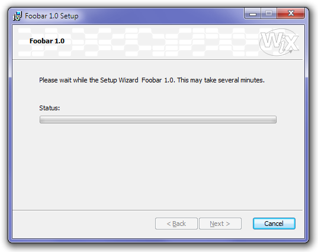

Something still missing from our growing user interface is a page showing how the installation process progresses.

We define this dialog to be _modeless_ because we need the control to return to the installer. This will in turn send the dialog progress messages to be processed.

    <Dialog Id="ProgressDlg" Width="370" Height="270" Title="[ProductName] Setup" Modeless="yes">

The `Back` and `Next` buttons will be disabled by default---there's no reason to keep them active, the user can't use them, anyway. If necessary, `Cancel` can be used to abort the installation:

    <Control Id="Cancel" Type="PushButton" X="304" Y="243" Width="56" Height="17"
        Default="yes" Cancel="yes" Text="[ButtonText_Cancel]">
        <Publish Event="SpawnDialog" Value="CancelDlg">1</Publish>
    </Control>
    <Control Id="BannerBitmap" Type="Bitmap" X="0" Y="0" Width="370" Height="44"
        TabSkip="no" Text="[BannerBitmap]" />
    <Control Id="Back" Type="PushButton" X="180" Y="243" Width="56" Height="17"
        Disabled="yes" Text="[ButtonText_Back]" />
    <Control Id="Next" Type="PushButton" X="236" Y="243" Width="56" Height="17"
        Disabled="yes" Text="[ButtonText_Next]" />

The text control just above the progress bar subscribes to the `ActionText` event, thus the installer keeps publishing the name of the current installation action to it:

    <Control Id="ActionText" Type="Text" X="70" Y="100" Width="265" Height="10">
        <Subscribe Event="ActionText" Attribute="Text" />
    </Control>

If you are not satisfied with a description of the major steps but would like to see the details of the individual files as they are deployed, you can also use the `ActionData` event instead:

    <Control Id="ActionData" Type="Text" X="70" Y="100" Width="265" Height="30">
        <Subscribe Event="ActionData" Attribute="Text" />
    </Control>

In addition to some uninteresting controls, we finally have the workhorse of this dialog, a control of `ProgressBar` type. Just like with `SelectionTree`, the control provided by the installer is not just a generic progress bar but one linked directly to the installation process. By subscribing to the `SetProgress` event with an attribute `Progress` the installer will keep sending progress messages for display. `ProgressBlocks=yes` calls for the newer type progress bar with blocks. Setting it to _no_ will revert to the old-style continuous bar from the Windows 95 era:

    <Control Id="ProgressBar" Type="ProgressBar" X="35" Y="115" Width="300" Height="10"
        ProgressBlocks="yes" Text="Progress done">
        <Subscribe Event="SetProgress" Attribute="Progress" />
    </Control>

    <Control Id="StatusLabel" Type="Text" X="35" Y="100" Width="35" Height="10"
        Text="Status:" />

To integrate our progress page with the rest of the installation package, we only have to modify our `InstallDlg` dialog to call this dialog. The rest will be done automagically:

    <Dialog Id="InstallDlg" Width="370" Height="270" Title="[ProductName] Setup" NoMinimize="yes">
      <Control Id="Install" Type="PushButton" X="236" Y="243" Width="56" Height="17"
        Default="yes" Text="[ButtonText_Install]">
        <Publish Event="NewDialog" Value="ProgressDlg" />
      </Control>
