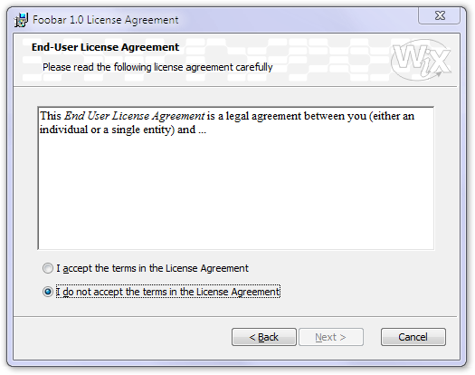

There are a few other niceties left, like a license agreement page:

    <Dialog Id="LicenseAgreementDlg" Width="370" Height="270"
        Title="[ProductName] License Agreement" NoMinimize="yes">

For a radio button group, we'll have a separate description later in the source, the link is established by the `Property` attribute:

    <Control Id="Buttons" Type="RadioButtonGroup"
      X="20" Y="187" Width="330" Height="40" Property="IAgree" />

    <Control Id="Back" Type="PushButton" X="180" Y="243" Width="56" Height="17"
      Text="[ButtonText_Back]">
      <Publish Event="NewDialog" Value="WelcomeDlg">1</Publish>
    </Control>

    <Control Id="Next" Type="PushButton" X="236" Y="243" Width="56" Height="17"
      Default="yes" Text="[ButtonText_Next]">

The selection of the next dialog is a bit trickier now. In some installations, we don't want to ask for the user name, company name and registration key. It would also be possible to modify the UI accordingly (simply not to call that page in the sequence of pages) but this solution is much more elegant. Somewhere among the properties we have one called `ShowUserRegistrationDlg`. If we set it to one, the User Registration page will be shown. If set to zero, this page will be skipped. This means two `NewDialog` events, one for each possible case:

    <Publish Event="NewDialog" Value="UserRegistrationDlg">
        <![CDATA[IAgree = "Yes" AND ShowUserRegistrationDlg = 1]]>
    </Publish>

    <Publish Event="NewDialog" Value="SetupTypeDlg">
        <![CDATA[IAgree = "Yes" AND ShowUserRegistrationDlg <> 1]]>
    </Publish>

`SpawnDialog` and `SpawnWaitDialog` events don't replace the previous page but start a new, child dialog box. The first will wait for user interaction to be dismissed but the second will only be visible until the conditional expression remains false. In our case, it is a wait dialog only visible while the installer is calculating the disk requirement. For a small installation package like our sample, this takes no time at all, so you aren't likely to have the chance of seeing this dialog in action. However, let's have it there just in case. `CostingComplete` is a predefined property that is set to 1 when the disk requirement calculations are finished.

    <Publish Event="SpawnWaitDialog" Value="WaitForCostingDlg">
        CostingComplete = 1
    </Publish>

And, finally, the well known nuisance: the Next button will stay disabled until the user has signaled their acceptance of the license agreement. We already used `Condition` tags at the upper level (launch conditions to determine whether the whole installation process should run) or inside `Feature` tags (to conditionally disable the installation of various features). This is their third use, inside `Control` tags. Using their `Action` attribute, they can _disable_, _enable_, _hide_ or _show_ the control, or to revert it to its _default_ state), if the condition inside the tag evaluates to true:

    <Condition Action="disable">
        <![CDATA[IAgree <> "Yes"]]>
    </Condition>

    <Condition Action="enable">
        IAgree = "Yes"
    </Condition>

The following parts are already familiar:

    <Control Id="Cancel" Type="PushButton" X="304" Y="243" Width="56" Height="17"
      Cancel="yes" Text="[ButtonText_Cancel]">
      <Publish Event="SpawnDialog" Value="CancelDlg">1</Publish>
    </Control>

    <Control Id="BannerBitmap" Type="Bitmap" X="0" Y="0" Width="370" Height="44"
      TabSkip="no" Text="[BannerBitmap]" />

The text of the license agreement comes next. We open up a sunken text with scrollable contents. The actual text comes into the inner `Text` tag. You can use RTF-style text here, so the best idea is to author your license agreement in a word processor and export it to RTF (Wordpad is probably the best word processor for this purpose, more sophisticated ones might create much more verbose RTF files; even if you use those, consider re-saving the final version from Wordpad):

    <Control Id="AgreementText" Type="ScrollableText" X="20" Y="60" Width="330" Height="120"
      Sunken="yes" TabSkip="no">
      <Text SourceFile="Binary\License.rtf" />
    </Control>

You could also specify the agreement text right here in the source file but the previous solution seems much easier to maintain:

    <Text>{\rtf1\ansi\ansicpg1252\deff0\deftab720
        {\fonttbl{\f0\froman\fprq2 Times New Roman;}}
        {\colortbl\red0\green0\blue0;}
        \deflang1033\horzdoc{\*\fchars }{\*\lchars }
        \pard\plain\f0\fs20
        This End User License Agreement is a legal agreement between you
        (either an individual or a single entity) and ...\par
        }

And the remaining part is really simple and deserves no detailed description. A few title lines here, a horizontal line there make up the rest of the dialog.

    <Control Id="Description" Type="Text" X="25" Y="23" Width="280" Height="15"
      Transparent="yes" NoPrefix="yes">
      <Text>Please read the following license agreement carefully</Text>
    </Control>
    <Control Id="BottomLine" Type="Line" X="0" Y="234" Width="370" Height="0" />
    <Control Id="Title" Type="Text" X="15" Y="6" Width="200" Height="15"
      Transparent="yes" NoPrefix="yes">
      <Text>{\DlgTitleFont}End-User License Agreement</Text>
    </Control>
    <Control Id="BannerLine" Type="Line" X="0" Y="44" Width="374" Height="0" />

We still have a little debt to take care of. In the first control of the dialog, we referred to a radio button group description and left it pending. So, here it is. Note the property replacement in the `Text` attribute, this is how you can define font, size and color for your texts:

    <RadioButtonGroup Property="IAgree">
        <RadioButton Text="{\DlgFont8}I &accept the terms in the License Agreement"
            Value="Yes" X="5" Y="0" Width="250" Height="15" />
        <RadioButton Text="{\DlgFont8}I &do not accept the terms in the License Agreement"
            Value="No" X="5" Y="20" Width="250" Height="15" />
    </RadioButtonGroup>

But where these font specifiers come from, you might ask? OK, here they are. A nice, centralized way to specify various text styles and simply refer to them from everywhere throughout the user interface. For color, your can use the `Red`, `Green` and `Blue` attributes (a value between 0 and 255 for each), for additional decoration, `Bold`, `Italic, `Underline` and `Strike`:

    <TextStyle Id="DlgFont8" FaceName="Tahoma" Size="8" />
    <TextStyle Id="DlgTitleFont" FaceName="Tahoma" Size="8" Bold="yes" />
    <TextStyle Id="VerdanaBold13" FaceName="Verdana" Size="13" Bold="yes" />

We end our source file with the properties---basically, our variables with their initialization values. Some are used as shorthand notation for user interface element texts, you need to localize them as well. Take care of the ampersand and angle bracket characters: you either wrap the whole value into a CDATA wrapper or you have to use XML entities for these tricky characters (compare the values of `ButtonText_Next` and `ButtonText_Back`):

    <Property Id="ALLUSERS">2</Property>
    <Property Id="ROOTDRIVE"><![CDATA[C:\]]></Property>
    <Property Id="Setup">Setup</Property>
    <Property Id="ButtonText_Next">&amp;Next &gt;</Property>
    <Property Id="ButtonText_Back"><![CDATA[< &Back]]></Property>

We had files coming with us in the installation package we don't want to install with our product but are needed for the user interface: bitmaps and icons. We mention them at the end of the source file. We've referred to them earlier using their `Id` identifier but now we specify the actual file names. These files will be placed into the .msi rather than the .cab file, even if we ask for a separate cabinet:

    <Binary Id="Up" SourceFile="Binary\Up.ico" />
    <Binary Id="New" SourceFile="Binary\New.ico" />
    <Binary Id="custicon" SourceFile="Binary\Custom.ico" />
    <Binary Id="repairic" SourceFile="Binary\Repair.ico" />
    <Binary Id="exclamic" SourceFile="Binary\Exclam.ico" />
    <Binary Id="removico" SourceFile="Binary\Remove.ico" />
    <Binary Id="completi" SourceFile="Binary\Complete.ico" />
    <Binary Id="insticon" SourceFile="Binary\Typical.ico" />
    <Binary Id="info" SourceFile="Binary\Info.ico" />
    <Binary Id="bannrbmp" SourceFile="Binary\Banner.bmp" />
    <Binary Id="dlgbmp" SourceFile="Binary\Dialog.bmp" />
    <Icon Id="Foobar10.exe" SourceFile="FoobarAppl10.exe" />

If you want to change the bitmaps or icons, just do so in the Binary directory. The front page bitmap (named `Dialog.bmp` here) is a 503 by 314 pixel BMP while the top banner bitmap has 500 by 63 pixels. But note that Windows Installer might stretch or shrink these bitmaps if the system font and display resolution settings of the user ask for a scaling of the whole interface. To avoid ugly scaling artefacts, make sure you use appropriate bitmaps. Avoid thin lines supposed to look uniform across the picture, never incorporate text into the bitmaps (letters in logos are OK but small text meant to be read is not). And, above all, avoid dithered areas and checkered backgrounds, those might look very awkward when scaled. To get an idea, experiment with various scaling factors in your picture editor, making sure you turn off sophisticated algorithms like bicubic sampling; Windows will only use plain stretching and shrinking.
