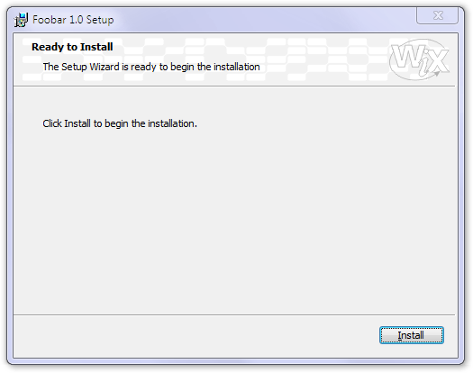

In our SampleCustomUI2, we stay with the same single dialog but tune it up a little bit.

    <Dialog Id="InstallDlg" Width="370" Height="270" Title="[ProductName] Setup" NoMinimize="yes">

This is only a small change: instead of specifying the button text directly, we use a property. This will make localization easier at a later stage:

    <Control Id="Install" Type="PushButton" X="304" Y="243" Width="56" Height="17"
        Default="yes" Text="[ButtonText_Install]">
        <Publish Event="EndDialog" Value="Return" />
    </Control>

A simple banner bitmap at the top of the dialog. Note that we use a property to refer to the binary attachment. Although it is specified in the `Text` attribute, this is not a text but the `Id` of the bitmap stored in the package.

    <Control Id="BannerBitmap" Type="Bitmap" X="0" Y="0" Width="370" Height="44" TabSkip="no" Text="[BannerBitmap]" />

Two text lines, one transparent over the banner bitmap and another one in the actual dialog work area:

    <Control Id="Description" Type="Text" X="25" Y="23" Width="280" Height="15"
        Transparent="yes" NoPrefix="yes">
        <Text>The [Wizard] is ready to begin the installation</Text>
    </Control>

    <Control Id="Text" Type="Text" X="25" Y="70" Width="320" Height="20">
        <Text>Click Install to begin the installation.</Text>
    </Control>

A horizontal line to mark the bottom of the dialog area---aesthetics, nothing else:

    <Control Id="BottomLine" Type="Line" X="0" Y="234" Width="370" Height="0" />

Finally, the title and the embossed line just below the banner bitmap:

    <Control Id="Title" Type="Text" X="15" Y="6" Width="200" Height="15"
        Transparent="yes" NoPrefix="yes">
        <Text>{\DlgTitleFont}Ready to Install</Text>
    </Control>

    <Control Id="BannerLine" Type="Line" X="0" Y="44" Width="370" Height="0" />

Let's not forget that we referenced a banner bitmap so we have to include it in the package:

    <Binary Id="bannrbmp" SourceFile="Binary\Banner.bmp" />
