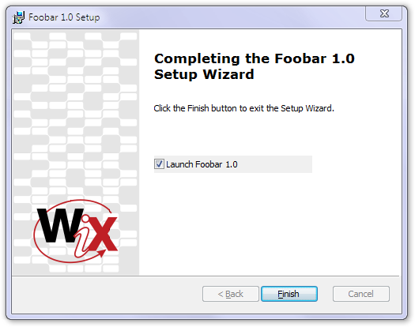

There is only one thing missing, a way to launch the application after the installation. This will also show us how to use a checkbox and make decisions depending on its state.

The newly added dialog looks like this:

    <Dialog Id="ExitDlg" Width="370" Height="270" Title="[ProductName] Setup" NoMinimize="yes">

The `Finish` button will have two tasks to carry out: first, to dismiss the dialog itself (and with this, to end the installation package itself) and second, to launch the application if the user chose to do so:

    <Control Id="Finish" Type="PushButton" X="236" Y="243" Width="56" Height="17"
        Default="yes" Cancel="yes" Text="[ButtonText_Finish]">
        <Publish Event="EndDialog" Value="Return">1</Publish>
        <Publish Event='DoAction' Value='LaunchFile'>(NOT Installed) AND (LAUNCHPRODUCT = 1)</Publish>
    </Control>

The checkbox control in the dialog box has both its initial setting (`CheckBoxValue`) and an associated property (`LAUNCHPRODUCT`) that will be used to read its state:

    <Control Id="Launch" Type="CheckBox" X="135" Y="120" Width="150" Height="17"
        Property='LAUNCHPRODUCT' CheckBoxValue='1'>
        <Text>Launch [ProductName]</Text>
    </Control>

The action published by the `Finish` button is an already familiar custom action. Don't forget the `Return` attribute to make sure the installer can close while the application stays running:

    <CustomAction Id='LaunchFile' FileKey='FoobarEXE' ExeCommand='' Return="asyncNoWait" />

The Exit dialog will be scheduled upon successful completion (see the next section for details):

    <InstallUISequence>
        <Show Dialog="ExitDlg" OnExit="success" />
    </InstallUISequence>

Chechboxes and properties are linked but only when events occur, when the user sets or clears them. Initially, without user interaction, nothing makes the property receive the default value we've set in the `Control` tag. We have to make sure we initialize the property ourselves:

    <Property Id="LAUNCHPRODUCT">1</Property>

Before you build the SampleCustomUI6, make sure you replace the dummy .exe file with something that will actually run.

And a common complaint: no, the checkbox can't have a transparent background. If you have a bitmap in the background, it will be ugly, just like in our example above. The only workaround is to reduce the width of the checkbox to the actual box itself and to place an additional static text (these can be made transparent) adjacent to it.
